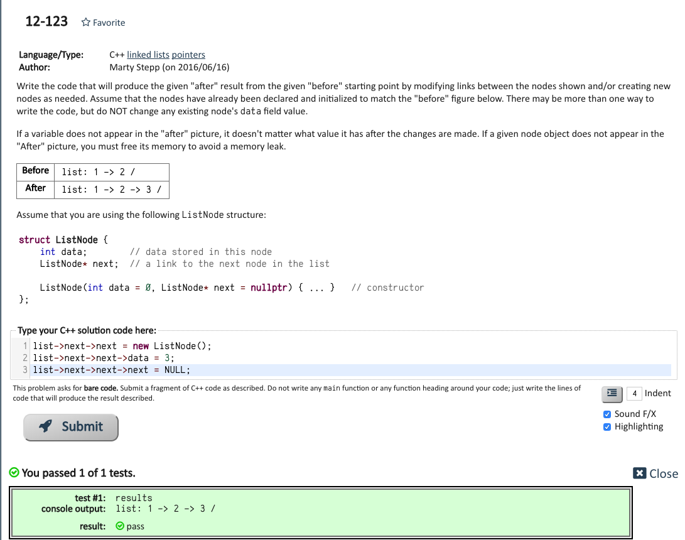
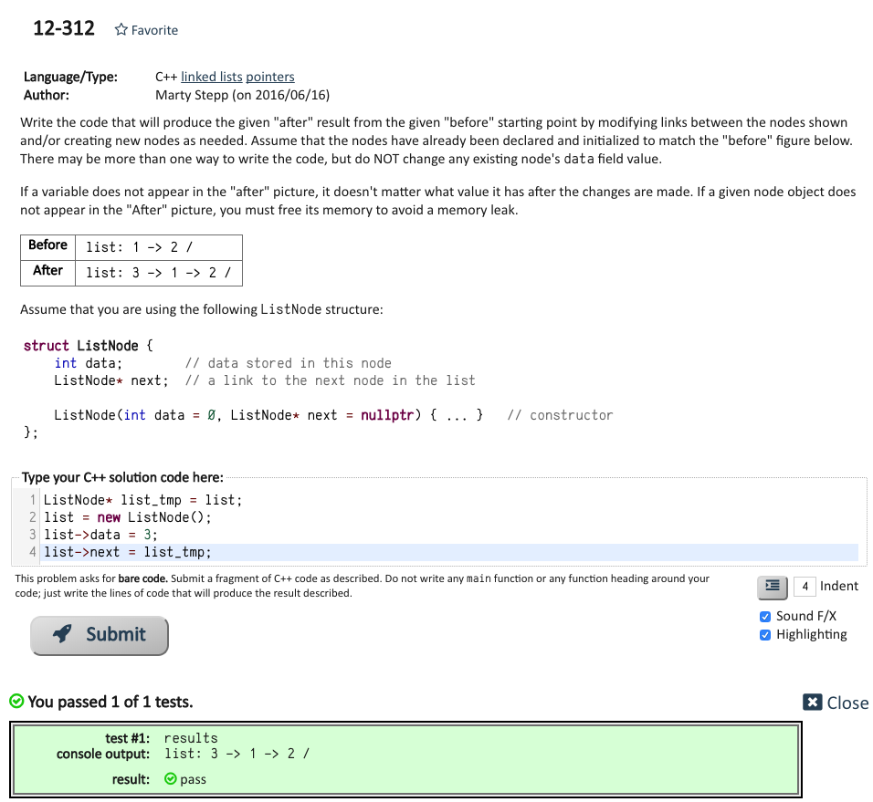
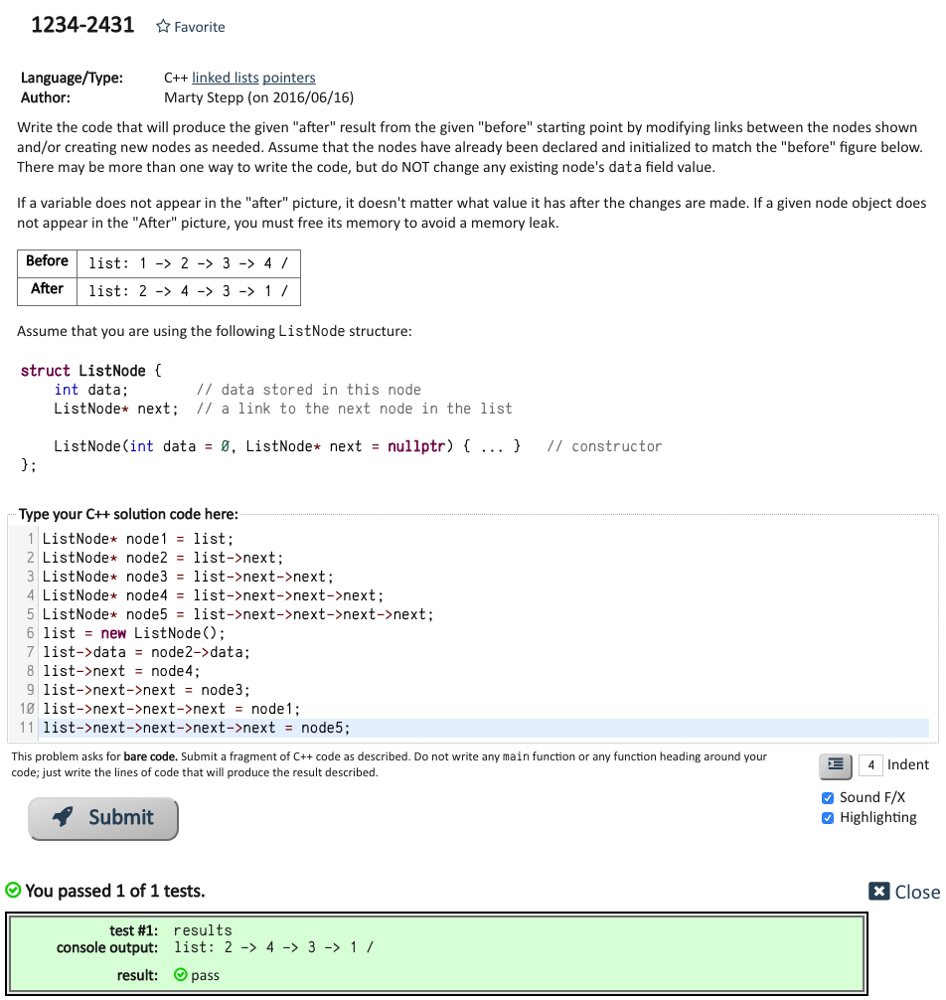
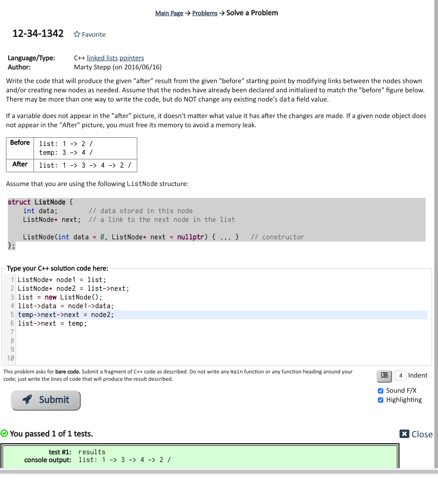

# problem list:

https://www.codestepbystep.com/problem/list

# Agenda

- [Problem1](#problem1)
- [Problem2](#problem2)
- [Problem3](#problem3)
- [Problem4](#problem4)
- [Problem5](#problem5)
- [Problem6](#problem6)
- [Problem7](#problem7)
- [Problem8](#problem8)
- [Problem9](#problem9)
- [Problem10](#problem10)
- [Problem11](#problem11)
- [Problem12](#problem12)
- [Problem13](#problem13)
- [Problem14](#problem14)
- [Problem15](#problem15)
- [Problem16](#problem16)

# problem1

https://www.codestepbystep.com/problem/view/cpp/collectionimpl/linkedlistnode/12-12

# problem2

https://www.codestepbystep.com/problem/view/cpp/collectionimpl/linkedlistnode/12-312

# problem3

https://www.codestepbystep.com/problem/view/cpp/collectionimpl/linkedlistnode/1234-2431

# problem4

https://www.codestepbystep.com/problem/view/cpp/collectionimpl/linkedlistnode/12-34-1342

# problem5

https://www.codestepbystep.com/problem/view/cpp/collectionimpl/linkedlistptr/linkedListMystery1

# problem6

https://www.codestepbystep.com/problem/view/cpp/collectionimpl/linkedlistptr/linkedListMystery2

# problem7

https://www.codestepbystep.com/problem/view/cpp/collectionimpl/linkedlistptr/linkedListMystery3

# problem8

https://www.codestepbystep.com/problem/view/cpp/collectionimpl/linkedlistptr/linkedListMystery4

# problem9

https://www.codestepbystep.com/problem/view/cpp/collectionimpl/linkedlistptr/min

# problem10

https://www.codestepbystep.com/problem/view/cpp/collectionimpl/linkedlistptr/isSorted

# problem11

https://www.codestepbystep.com/problem/view/cpp/collectionimpl/linkedlistptr/countDuplicates

# problem12

https://www.codestepbystep.com/problem/view/cpp/collectionimpl/linkedlistptr/countDuplicateStrings

# problem13

https://www.codestepbystep.com/problem/view/cpp/collectionimpl/linkedlist/min

# problem14

https://www.codestepbystep.com/problem/view/cpp/collectionimpl/linkedlist/isSorted

# problem15

https://www.codestepbystep.com/problem/view/cpp/collectionimpl/linkedlist/countDuplicates

# problem16

https://www.codestepbystep.com/problem/view/cpp/collectionimpl/linkedlist/stutter

