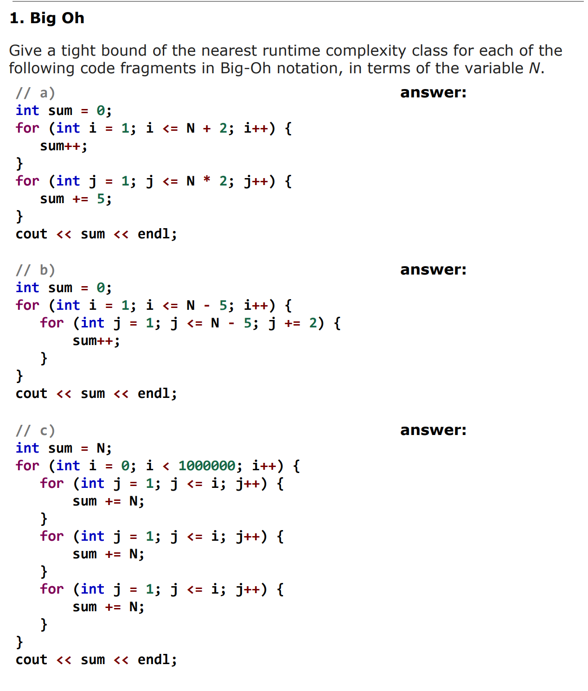
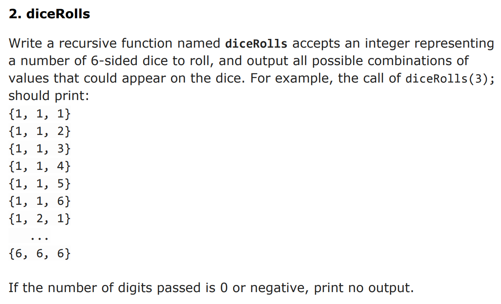
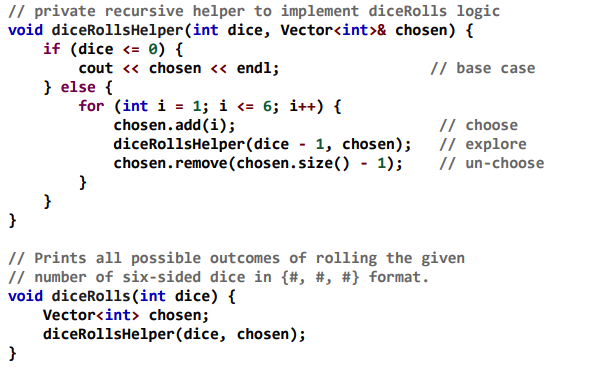
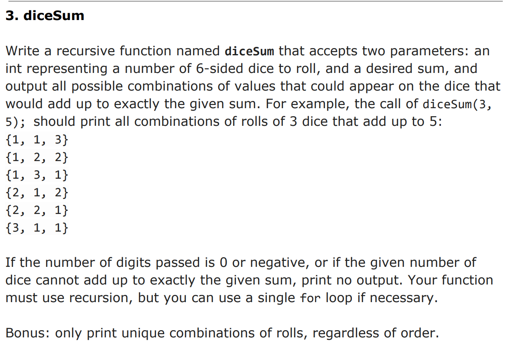
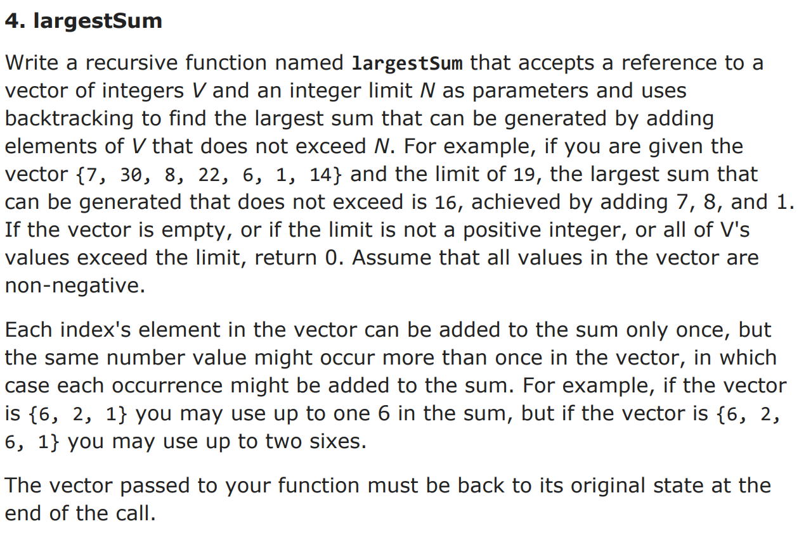
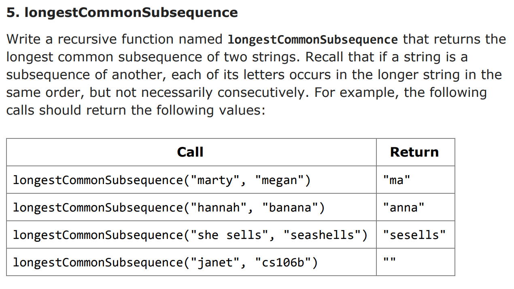
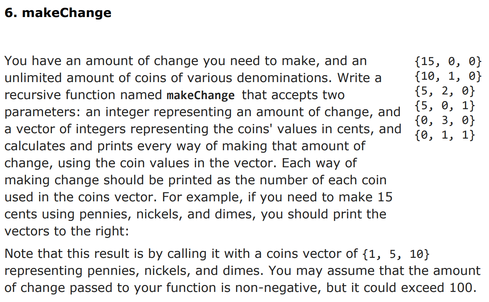
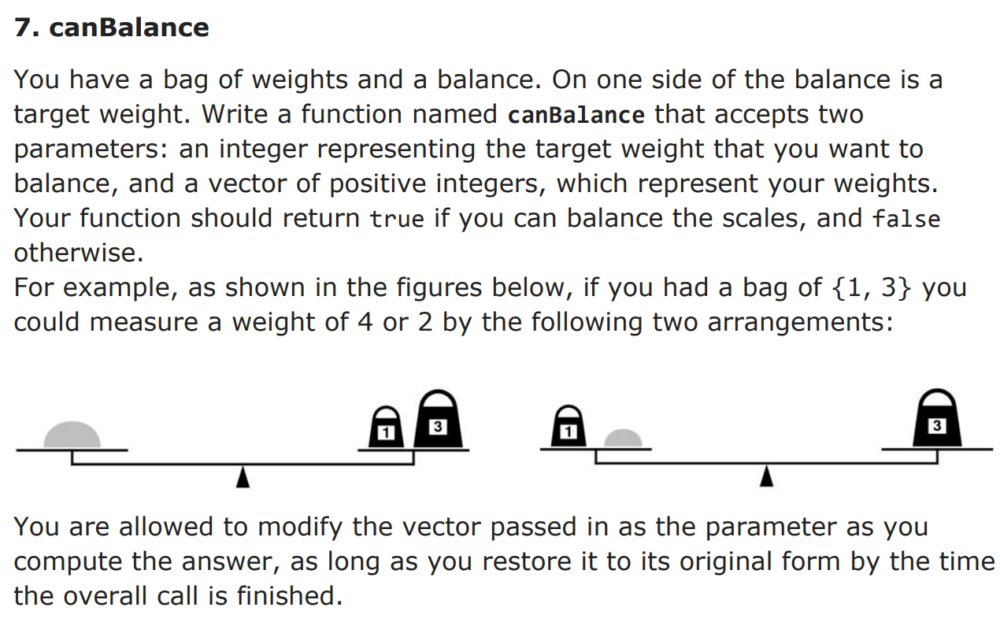

## Agenda

* [Reference](#Reference)  
* [My Solution](#My_Solution)  
    * [problem1](#problem1)  
    * [problem2](#problem2)  
    * [problem3](#problem3)  
    * [problem4](#problem4)  
    * [problem5](#problem5)  
    * [problem6](#problem6)  
    * [problem7](#problem7) 

## Reference

Problems: http://web.stanford.edu/class/cs106b//sections/section03.pdf  
Solutions: http://web.stanford.edu/class/cs106b//sections/section03-solutions.pdf  

## My_Solution

### problem1

<p align="center">
    
    </img>
</p>

Answer: O(n), O(n^2), O(n)  
**Note: the correct solution for the last one is O(1).  
The lesson is: If there is no computation in loop, the loop should be treated as O(1).**

### problem2

<p align="center">
    
    </img>
</p>

Answer:
```c++
void diceRecur(int & n, vector<string> & v ){
    if(n>1){
        n--;
        diceRecur(n, v);
        vector<string> tmp_v = v;
        v.clear();
        for(string x: tmp_v){
            for (int i=1; i<=6; i++){
                v.push_back(to_string(i)+x);
            }
        }
    }else if ( n==1 ){
        for (int i=1; i<=6; i++){
            v.push_back(to_string(i));
        }
    }
}

void diceRolls(int n){
    if (n >= 1){
        vector<string> v;
        diceRecur(n, v);
        for (string x: v){
            cout << x << endl;
        }
    }
}
```
Better solution, which cost much less memory:  
<p align="center">
    
    </img>
</p>

### problem3

<p align="center">
    
    </img>
</p>

Answer:
```c++
void diceSumHelper(int n, vector<int> & v, int & sum ){
    if(n>0 && sum >0){
        for(int i=1; i<=6; i++){
            sum = sum - i;
            if (sum>=0){
                v.push_back(i);
                diceSumHelper(n-1, v, sum);
                v.pop_back();
            }
            sum = sum + i;
        }
    }else if (n == 0 && sum == 0 ){
        cout << "{";
        for (int x: v){
            cout << to_string(x) << ",";
        }
        cout <<"}" << endl;
    }
}

void diceSum(int n, int sum){
    if (n >= 1 and sum >= 1){
        vector<int> v;
        diceSumHelper(n, v, sum);
    }
}
```


### problem4

<p align="center">
    
    </img>
</p>

### problem5

<p align="center">
    
    </img>
</p>

### problem6

<p align="center">
    
    </img>
</p>

### problem7

<p align="center">
    
    </img>
</p>
