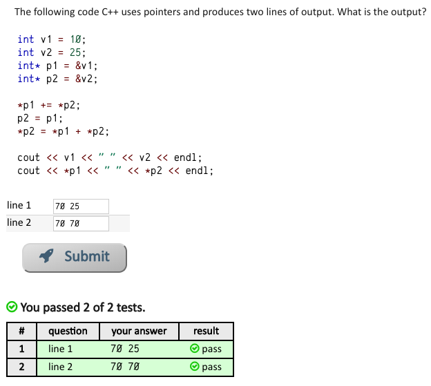
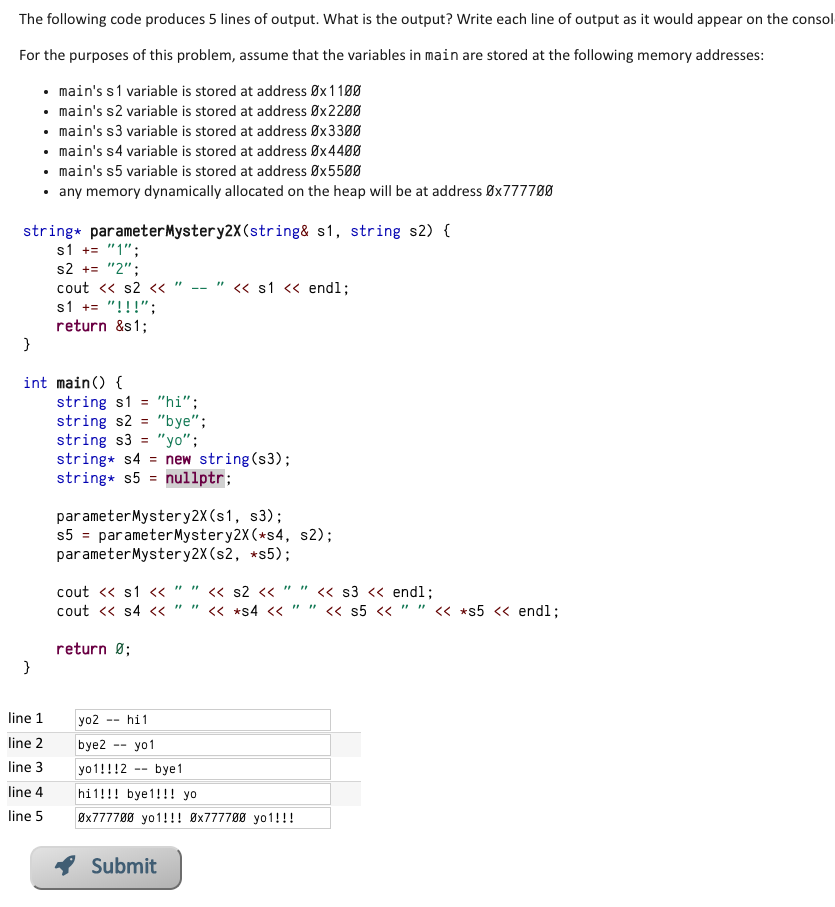

problems set: https://www.codestepbystep.com/problem/list


* https://www.codestepbystep.com/problem/view/cpp/pointers/v1v2p1p2:  



* https://www.codestepbystep.com/problem/view/cpp/pointers/parameterMystery1:  


Note:

```c++
int parameterMystery1(int a, int& b, int*c){
    b++; // reference the value of b, update the value of b at address "0xbb00"
    a += *c; // take care that a' scope is just in this function
    cout << b << " " << *c << " " << a << " " << c << endl;
    // point c's address to a's address, 
    // but c's scope is also just in this function
    c = &a; 
    return a - b;
}
```  
compare below two experiments, reference address scope is only in function, 
reference value scope can out of function.  
* ```c++
int parameterMystery1(int a, int& b, int* c){
    b++;
    a += *c;
    c = &a;
    //*c = a;
    cout << "a is: " << a << " at: " << &a << endl;
    cout << "c is: " << *c << " at: " << c << endl;
    return a - b;
}
int main(){
    int a = 4;
    int b = 8;
    int c = -3;
    int d;
    cout << "a is: " << a << " at: " << &a << endl;
    cout << "c is: " << c << " at: " << &c << endl;
    cout << "in function" << endl;
    d = parameterMystery1(a,b, &c);
    cout << "after function" << endl;
    cout << "a is: " << a << " at: " << &a << endl;
    cout << "c is: " << c << " at: " << &c << endl;

    return 0;
}
```
output:  
```
a is: 4 at: 0x7ffeee309a2c
c is: -3 at: 0x7ffeee309a24
in function
a is: 1 at: 0x7ffeee3099bc
c is: 1 at: 0x7ffeee3099bc
after function
a is: 4 at: 0x7ffeee309a2c
c is: -3 at: 0x7ffeee309a24
```  


* ```c++
int parameterMystery1(int a, int& b, int* c){
    b++;
    a += *c;
//    c = &a;
    *c = a;
    cout << "a is: " << a << " at: " << &a << endl;
    cout << "c is: " << *c << " at: " << c << endl;
    return a - b;
}
```
output:  
```
a is: 4 at: 0x7ffee9d6fa2c
c is: -3 at: 0x7ffee9d6fa24
in function
a is: 1 at: 0x7ffee9d6f9bc
c is: 1 at: 0x7ffee9d6fa24
after function
a is: 4 at: 0x7ffee9d6fa2c
c is: 1 at: 0x7ffee9d6fa24
```

* https://www.codestepbystep.com/problem/view/cpp/pointers/parameterMystery1X


* https://www.codestepbystep.com/problem/view/cpp/pointers/parameterMystery2X

  

**break down**:  

variable | value  | address
-------- | ------ | -------- 
s1  | hi    | 0x1100  
s2  | bye     | 0x2200
s3  | yo    | 0x3300
s4  | heap address 0x777700 with value "yo" | 0x4400
s5  | NULL | 0x5500

In ```parameterMystery2X(s1, s3)```:  

operation | variable | value| address
--------- | -------- | ---- | -------
s1 += "1" | s1      | hi1   | 0x1100
s2 += "2" | s3      | yo2  | tmp in stack, which will discard after the function
cout      | | yo2 -- hi1|
s1 += "!!!"| s1 | hi1!!! | 0x1100
return | | do nothing |

after above function, the main is:  

variable | value  | address
-------- | ------ | -------- 
s1  | hi1!!!    | 0x1100  
s2  | bye     | 0x2200
s3  | yo    | 0x3300
s4  | heap address 0x777700 with value "yo" | 0x4400
s5  | NULL | 0x5500

In ```s5 = parameterMystery2X(*s4, s2)```

operation | variable | value| address
--------- | -------- | ---- | -------
s1 += "1" | ```*s4```  | yo1   | 0x777700
s2 += "2" | s2      | bye2  | tmp in stack, which will discard after the function
cout      | | bye2 -- yo1|
s1 += "!!!"| ```*s4``` | yo1!!! | 0x777700
return | | 0x777700 | |

after above function, the main is:  

variable | value  | address
-------- | ------ | -------- 
s1  | hi1!!!    | 0x1100  
s2  | bye     | 0x2200
s3  | yo    | 0x3300
s4  | heap address 0x777700 with value "yo1!!!" | 0x4400
s5  | heap address 0x777700 with value "yo1!!!"     | 0x5500 

In ```parameterMystery2X(s2, *s5)```  

operation | variable | value| address
--------- | -------- | ---- | -------
s1 += "1" | s2      | bye1   | 0x2200
s2 += "2" | ```*s5```      | yo1!!!2  | tmp in stack, which will discard after the function
cout      | | yo1!!!2 -- bye1 |
s1 += "!!!"| s2 | bye1!!! | 0x2200
return | | do nothing |

after above function, the main is:   

variable | value  | address
-------- | ------ | -------- 
s1  | hi1!!!    | 0x1100  
s2  | bye1!!!     | 0x2200
s3  | yo    | 0x3300
s4  | heap address 0x777700 with value "yo1!!!" | 0x4400
s5  | heap address 0x777700 with value "yo1!!!"     | 0x5500 


