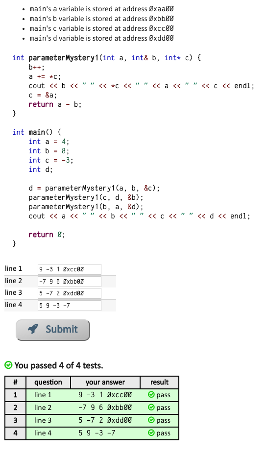

problems set: https://www.codestepbystep.com/problem/list

## Agenda:  

- [Problem1](#Problem1)
- [Problem2](#Problem2)
- [Problem3](#Problem3)
- [Problem4](#Problem4)
- [Problem5](#Problem5)
- [Problem6](#Problem6)
- [Problem7](#Problem7)
- [Problem8](#Problem8)


## Problem1

https://www.codestepbystep.com/problem/view/cpp/pointers/v1v2p1p2:  


## Problem2

https://www.codestepbystep.com/problem/view/cpp/pointers/parameterMystery1:  



Note:
Testing code snippets:
```c++
int parameterMystery1(int a, int& b, int*c){
    b++; // b is passed by reference, update the value of b at address "0xbb00"
    a += *c; // take care that a' scope is just in this function
    cout << b << " " << *c << " " << a << " " << c << endl;
    // point c's address to a's address, 
    // but c's scope is also just in this function
    c = &a; 
    return a - b;
}
int main(){
    int a = 4;
    int b = 8;
    int c = -3;
    int d;
    cout << "a is: " << a << " at: " << &a << endl;
    cout << "c is: " << c << " at: " << &c << endl;
    cout << "in function" << endl;
    d = parameterMystery1(a,b, &c);
    cout << "after function" << endl;
    cout << "a is: " << a << " at: " << &a << endl;
    cout << "c is: " << c << " at: " << &c << endl;

    return 0;
}
```  
compare below two experiments, reference address scope is only in function, 
reference scope can out of function.  

```c++
int parameterMystery1(int a, int& b, int* c){
    b++;
    a += *c;
    c = &a;
    //*c = a;
    cout << "a is: " << a << " at: " << &a << endl;
    cout << "c is: " << *c << " at: " << c << endl;
    return a - b;
}
```
output:  
```
a is: 4 at: 0x7ffeee309a2c
c is: -3 at: 0x7ffeee309a24
in function
a is: 1 at: 0x7ffeee3099bc
c is: 1 at: 0x7ffeee3099bc
after function
a is: 4 at: 0x7ffeee309a2c
c is: -3 at: 0x7ffeee309a24
```  

```c++
int parameterMystery1(int a, int& b, int* c){
    b++;
    a += *c;
//    c = &a;
    *c = a;
    cout << "a is: " << a << " at: " << &a << endl;
    cout << "c is: " << *c << " at: " << c << endl;
    return a - b;
}
```
output:  
```
a is: 4 at: 0x7ffee9d6fa2c
c is: -3 at: 0x7ffee9d6fa24
in function
a is: 1 at: 0x7ffee9d6f9bc
c is: 1 at: 0x7ffee9d6fa24
after function
a is: 4 at: 0x7ffee9d6fa2c
c is: 1 at: 0x7ffee9d6fa24
```

## Problem3

https://www.codestepbystep.com/problem/view/cpp/pointers/parameterMystery1X


## Problem4

https://www.codestepbystep.com/problem/view/cpp/pointers/parameterMystery2X

  

**break down**:  
main process start as:  

variable | value  | address
-------- | ------ | -------- 
s1  | hi    | 0x1100  
s2  | bye     | 0x2200
s3  | yo    | 0x3300
s4  | heap address "0x777700" with value "yo" | 0x4400
s5  | NULL pointer | 0x5500

-----------------------------------------------------------------


In ```parameterMystery2X(s1, s3)```:  

variable | value  | address
-------- | ------ | -------- 
s1  | hi+1=hi1+!!!=hi1!!!    | 0x1100  
s3  | yo+2=yo2    | temp address in stack

after above function, the main is:  

variable | value  | address
-------- | ------ | -------- 
s1  | hi1!!!    | 0x1100    
s2  | bye     | 0x2200
s3  | yo    | 0x3300
s4  | heap address "0x777700" with value "yo" | 0x4400
s5  | NULL pointer | 0x5500

-----------------------------------------------------------------

In ```s5 = parameterMystery2X(*s4, s2)```

variable | value  | address
-------- | ------ | --------   
```*```s4  | yo+1=yo1+!!!=yo1!!! | 0x777700
s2  | bye+2=bye2     | temp address in stack

Besides, ```s5 = &*s4=s4=0x777700```

After above function, the main status is:  

variable | value  | address
-------- | ------ | -------- 
s1  | hi1!!!    | 0x1100    
s2  | bye     | 0x2200
s3  | yo    | 0x3300
s4  | heap address "0x777700" with value "yo1!!!" | 0x4400
s5  | heap address "0x777700" with value "yo1!!!" | 0x5500

-----------------------------------------------------------------

In ```parameterMystery2X(s2, *s5)```  

variable | value  | address
-------- | ------ | --------  
s2  | bye+1=bye1+!!!=bye1!!!    | 0x2200
```*```s5  | yo1!!!+2=yo1!!!2 | temp address in stack

After above function, the main status is:  

variable | value  | address
-------- | ------ | -------- 
s1  | hi1!!!    | 0x1100    
s2  | bye1!!!     | 0x2200
s3  | yo    | 0x3300
s4  | heap address "0x777700" with value "yo1!!!2" | 0x4400
s5  | heap address "0x777700" with value "yo1!!!2" | 0x5500


## Problem5

https://www.codestepbystep.com/problem/view/cpp/pointers/parameterMystery3


Function:  

```c++
void parameterMystery3(int* a, int& b, int* c){
    // b is pass by reference
    // a, c are both pointers
    *a += *c;
    (*c)++;
    b--;
    cout << b << " " << *a << " " << *c << endl;
}
```

Break down as:  

The initial status in the main process:  

variable | value | address
-------- | ----- | --------
w        | 0     | ww
x        | 1     | xx
y        | 3     | yy
z        | 7     | zz

-----------------------------------------------------

In ```parameterMystery3(&y, x, &w)``` :  

variable | value | address
-------- | ----- | --------
&y       | stack address "yy" with value 3+0=3 | temp address in stack
x        | 1--=0 | xx
&w       | stack address "ww" with value 0+1=1 | temp address in stack

After that, the main process status is:  

variable | value | address
-------- | ----- | --------
w        | 1     | ww
x        | 0     | xx
y        | 3     | yy
z        | 7     | zz

-------------------------------------------------------

In ```parameterMystery3(&x, y, &z)``` :  

variable | value | address
-------- | ----- | --------
&x        | stack address "xx" with value 0+7=7     | temp address in stack
y        | 3-1=2     | yy
&z        | stack address "zz" with value 7+1=8     | temp address in stack

After that, the main process status is:  

variable | value | address
-------- | ----- | --------
w        | 1     | ww
x        | 7     | xx
y        | 2     | yy
z        | 8     | zz

-------------------------------------------------------

In ```parameterMystery3(&w, w, &z)``` :  
variable | value | address
-------- | ----- | --------
&w        | stack address "ww" with value 1+8=9-1=8     | temp address in stack
w        | 1+8=9-1=8     | ww
&z        | stack address "zz" with value 8+1=9     | temp address in stack

After that, the main process status is:  

variable | value | address
-------- | ----- | --------
w        | 8     | ww
x        | 7     | xx
y        | 2     | yy
z        | 9     | zz

## Problem6

https://www.codestepbystep.com/problem/view/cpp/pointers/parameterMystery4


Break down:  

The initial main process:  

variable | value | address
-------- | ----- | --------
a        | 2     | 0xaa00
b        | 5     | 0xbb00
c        | -3    | 0xcc00
d        | NULL  | 0xdd00

-------------------------------

In ```parameterMystery4(a, &b, c)```:  

variable | value | address
-------- | ----- | --------
a        | 2-1=1     | 0xaa00
&b       | address "0xbb00" with value 5+1=6  |  temp address in stack
c        | -3```*```2=-6    | temp address in stack

After that:  

variable | value | address
-------- | ----- | --------
a        | 1     | 0xaa00
b        | 6     | 0xbb00
c        | -3    | 0xcc00
d        | NULL  | 0xdd00

---------------------------------

In ```d = parameterMystery4(c, &a, b)```:  

variable | value | address
-------- | ----- | --------
c        | -3-1=-4    | 0xcc00
&a        | address "0xaa00" with value 1+1=2     | temp address in stack
b        | 6```*```2=12     | temp address in stack

Besides, ```d=c+b=(-4)+12=8```  

After that:  

variable | value | address
-------- | ----- | --------
a        | 2     | 0xaa00
b        | 6     | 0xbb00
c        | -4    | 0xcc00
d        | 8    | 0xdd00

-------------------------------------

In ```parameterMystery4(b, &d, a)```:  

variable | value | address
-------- | ----- | --------
b        | 6-1=5     | 0xbb00
&d       | address "0xdd00" with value 8+1=9    | temp address in stack
a        | 2*2=4     | temp address in stack

The final main process status is:    

variable | value | address
-------- | ----- | --------
a        | 2     | 0xaa00
b        | 5     | 0xbb00
c        | -4    | 0xcc00
d        | 9    | 0xdd00


## Problem7

https://www.codestepbystep.com/problem/view/cpp/pointers/parameterMystery5  

  

The initial main process status:  

variable | value | address
-------- | ----- | -------
b        | 0     | 0xbb00
d        | -1    | 0xdd00
e        | 5     | 0xee00
f        | 2     | 0xff00

------------------------------

In ```b = parameterMystery5(&d, e, f)```:  

variable | value | address
-------- | ----- | -------
&d   | address "0xdd00" with value -1->(5+2)=7  | temp address in stack 
e        | 5-1=4     | temp address in stack
f        | 2+10=12     | 0xff00

Besides, ```b=e+f=4+12=16```  

The main process status after above function:  

variable | value | address
-------- | ----- | -------
b        | 16     | 0xbb00
d        | 7    | 0xdd00
e        | 5     | 0xee00
f        | 12     | 0xff00

------------------------------

In ```parameterMystery5(&f, d, e)```:  

variable | value | address
-------- | ----- | -------
&f        | address "0xff00" with value 12->(7+2)=9  | temp address in stack 
d        | 7-1=6    | temp address in stack 
e        | 5+10=15     | 0xee00

The main process status after above function:  

variable | value | address
-------- | ----- | -------
b        | 16     | 0xbb00
d        | 7    | 0xdd00
e        | 15     | 0xee00
f        | 9     | 0xff00

-----------------------------

In ```parameterMystery5(&b, f, d)```:

variable | value | address
-------- | ----- | -------
b        | address "0xbb00" with value 16->(9+2)=11  | temp address in stack 
f        | 9-1=8     | temp address in stack 
d        | 7+10=17    | 0xdd00

The main process status after above function:  

variable | value | address
-------- | ----- | -------
b        | 11     | 0xbb00
d        | 17    | 0xdd00
e        | 15     | 0xee00
f        | 9     | 0xff00


## Problem8

https://www.codestepbystep.com/problem/view/cpp/pointers/parameterMystery9

  

The initial main process status:  

variable | value | address
-------- | ----- | -------
a        | 10    | aa
b        | 200   | bb
c        | 3000  | cc

-------------------

In ```parameterMystery9(&a, b, c)```:  

variable | value | address
-------- | ----- | -------
&a      | address "aa" with value 10+1=11    | temp address in stack
b        | 200+3=203   | bb
c        | 3000+5=3005  | temp address in stack

The main process status after above function:  

variable | value | address
-------- | ----- | -------
a        | 11    | aa
b        | 203   | bb
c        | 3000  | cc

------------------------------

In ```int d = parameterMystery9(&b, c, a)```:  

variable | value | address
-------- | ----- | -------
&b        | address "bb" with value 203+1=204   | temp address in stack
c        | 3000+3=3003  | cc
a        | 11+5=16    | temp address in stack

Besides, ```d=a=16```  

The main process status after above function:   

variable | value | address
-------- | ----- | -------
a        | 11    | aa
b        | 204   | bb
c        | 3003  | cc
d        | 16    | dd


